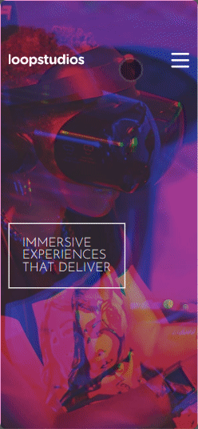

# Loopstudios landing page - Frontend Mentor challenge

This is a solution to the [Loopstudios landing page challenge on Frontend Mentor](https://www.frontendmentor.io/challenges/loopstudios-landing-page-N88J5Onjw).

---

## Summary

- [Overview](#overview)
  - [The challenge](#the-challenge)
    - [Expected Behaviour](#expected-behaviour)
    - [Design](#design)
    - [Challenge criteria](#challenge-criteria)
- [Page usage](#page-usage)
  - [Screenshots](#screenshots)
  - [Links](#links)
- [My process](#my-process)
  - [Useful resources](#useful-resources)
- [Author](#author)

---

## Overview

[▲ Back to summary](#summary)

### The challenge

The challenge is to build out this landing page and get it looking as close to the design as possible.
This challenge focuses mostly on HTML & CSS. The original challenge can be found [here](https://www.frontendmentor.io/challenges/loopstudios-landing-page-N88J5Onjw).

#### Expected Behaviour

- View the optimal layout for the site depending on their device's screen size
- See hover states for all interactive elements on the page

#### Design

**Desktop page design:**

---

**Page active states:**

---

**Mobile page:**

---

**Mobile menu:**

---

#### Challenge criteria

- HTML, CSS and JavaScript only.
- Layout as provided.

---

## Page usage

[▲ Back to summary](#summary)

To run this project, simply download the files and open the "index.html" file with your internet browser, or click on [URL of active website](https://jefersonborges.github.io/fem-loopstudios-landing-page-main/).

**Interactive page elements:**

- **Menu - desktop:**
  - **Links** - See the hover effects.
- **Menu - mobile:**
  - **Hamburger-menu** - Cick on the "hamburger menu" icon to see the opening menu effects and the dropdown menu.
- **Creations section**
  - **Cards** - See hover effects on the cards.
  - **See all button** - See hover effect on the button.
- **Footer section**
  - **Links**
    - **Footer Menu** - See the hover effects.
    - **Social links** - See the hover effects.

### Screenshots

**Desktop:**

---

**Mobile:**

---

### Links

- Solution URL: [Github repository](https://github.com/jefersonBorges/fem-loopstudios-landing-page-main)
- Live Site URL: [Github live page](https://jefersonborges.github.io/fem-loopstudios-landing-page-main/)

---

## My process

[▲ Back to summary](#summary)

**Made with:**

- Semantic **HTML**
- **CSS**
  - Flexbox
  - Grid
  - Variables
  - Media queries
  - Transitions and animations
  - Pseudo-elements and pseudo-classes
  - Combinators
  - Responsive images
  - Design modules

### Useful resources

- **Video:** [Responsive navigation with no js](https://youtu.be/8QKOaTYvYUA)
- **Documentation:** [HTML ``<picture>`` tag](https://developer.mozilla.org/pt-BR/docs/Web/HTML/Element/picture)
- **Documentation:** [HTML ``<figure>`` tag](https://developer.mozilla.org/pt-BR/docs/Web/HTML/Element/figure)

---

## Author

[▲ Back to summary](#summary)

- GitHub - [jefersonBorges](https://github.com/jefersonBorges/jefersonBorges)
- Frontend Mentor - [@jefersonBorges](https://www.frontendmentor.io/profile/jefersonBorges)
- Linkedin - [Jeferson Borges Linkedin](https://www.linkedin.com/in/jeferson-borges-543b34229)

---
